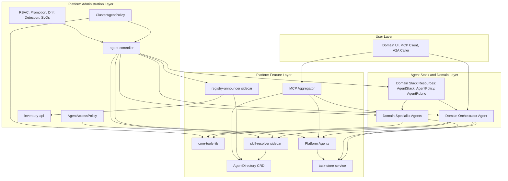
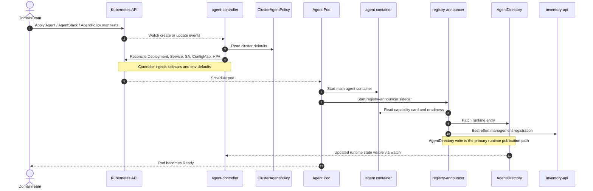
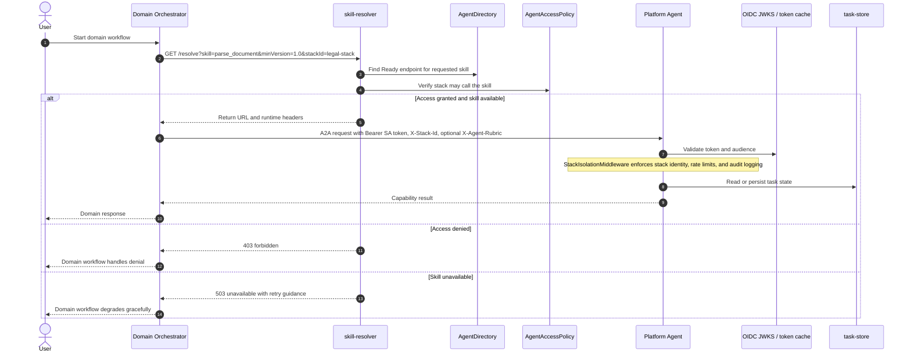
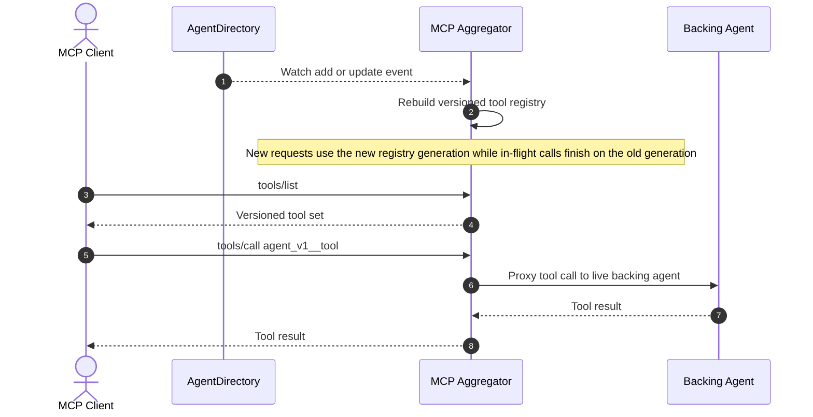

# Agent Orchestration Architecture Diagrams

This document captures the high-level system view and the main dynamic flows described in the planning docs for the agent orchestration platform.

## High-Level Architecture

### Reading the diagram

- The user layer talks to domain surfaces, not cluster primitives.
- Domain stacks own business workflow and call shared platform capabilities through platform-managed runtime components.
- Platform features carry runtime traffic.
- Platform administration governs policy, lifecycle, and compliance, but should stay out of runtime hot paths where possible.

## Sequence: Agent Deployment and Registration

This sequence shows how a domain agent becomes a running workload and how it is published into both the runtime and management planes.

### Deployment intent

- The controller owns lifecycle and sidecar injection.
- `registry-announcer` bridges the running pod into both the runtime plane and the management plane.
- `AgentDirectory` is the authoritative runtime publication path.

## Sequence: Runtime Cross-Stack A2A Flow

This is the core request path for a domain orchestrator calling a shared platform capability.

### Runtime intent

- Skill resolution and access control happen before the network call to the platform agent.
- Authentication and multi-tenant enforcement happen again at the platform agent boundary.
- Task state is centralized in `task-store`, not in individual agent pods.

## Sequence: MCP Aggregator Refresh and Tool Invocation

This sequence shows how the aggregated MCP surface stays current while routing user tool calls to live agents.

### MCP intent

- The MCP surface is derived from live runtime state, not static config.
- Versioned tool names reduce schema ambiguity during agent upgrades.
- Registry swaps are generation-based so updates do not interrupt in-flight tool calls.

## Source Basis

- `.planning/PROJECT.md`
- `.planning/REQUIREMENTS.md`
- `.planning/ROADMAP.md`
- `.planning/research/ARCHITECTURE.md`
- `.planning/research/FEATURES.md`
- `.planning/research/SUMMARY.md`
- `docs/federated-agent-stack.md`
